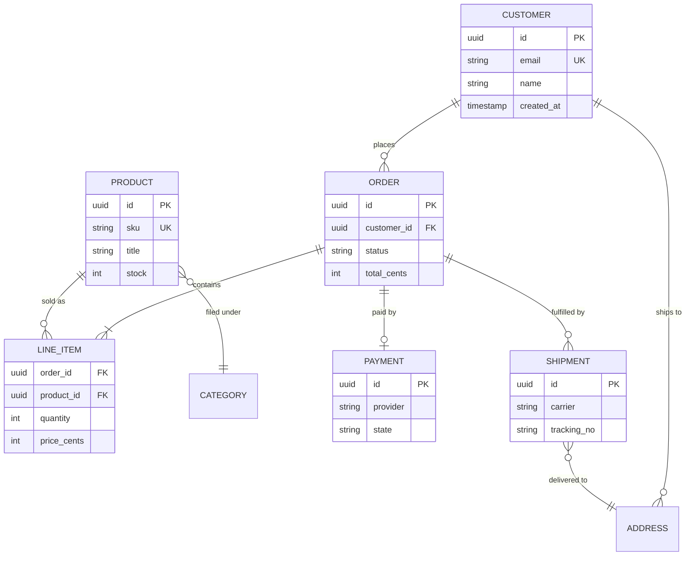
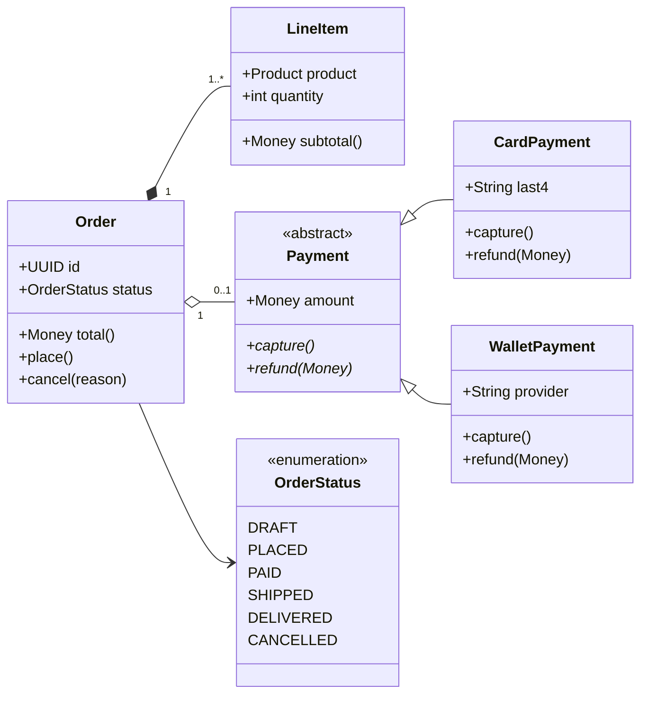

# Data model

## Tables

```mermaid
erDiagram
  CUSTOMER ||--o{ ORDER : places
  CUSTOMER ||--o{ ADDRESS : "ships to"
  ORDER ||--|{ LINE_ITEM : contains
  PRODUCT ||--o{ LINE_ITEM : "sold as"
  PRODUCT }o--|| CATEGORY : "filed under"
  ORDER ||--o| PAYMENT : "paid by"
  ORDER ||--o{ SHIPMENT : "fulfilled by"
  SHIPMENT }o--|| ADDRESS : "delivered to"

  CUSTOMER {
    uuid id PK
    string email UK
    string name
    timestamp created_at
  }
  ORDER {
    uuid id PK
    uuid customer_id FK
    string status
    int total_cents
  }
  LINE_ITEM {
    uuid order_id FK
    uuid product_id FK
    int quantity
    int price_cents
  }
  PRODUCT {
    uuid id PK
    string sku UK
    string title
    int stock
  }
  PAYMENT {
    uuid id PK
    string provider
    string state
  }
  SHIPMENT {
    uuid id PK
    string carrier
    string tracking_no
  }
```

## Domain classes

```mermaid
classDiagram
  direction LR
  class Order {
    +UUID id
    +OrderStatus status
    +Money total()
    +place()
    +cancel(reason)
  }
  class LineItem {
    +Product product
    +int quantity
    +Money subtotal()
  }
  class Payment {
    <<abstract>>
    +Money amount
    +capture()*
    +refund(Money)*
  }
  class CardPayment {
    +String last4
    +capture()
    +refund(Money)
  }
  class WalletPayment {
    +String provider
    +capture()
    +refund(Money)
  }
  class OrderStatus {
    <<enumeration>>
    DRAFT
    PLACED
    PAID
    SHIPPED
    DELIVERED
    CANCELLED
  }
  Order "1" *-- "1..*" LineItem
  Order "1" o-- "0..1" Payment
  Order --> OrderStatus
  Payment <|-- CardPayment
  Payment <|-- WalletPayment
```
