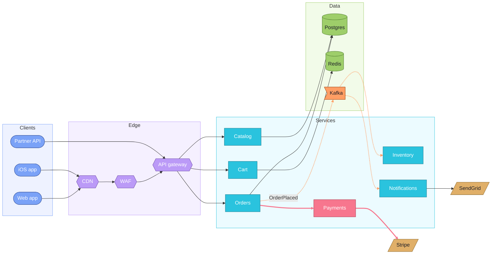
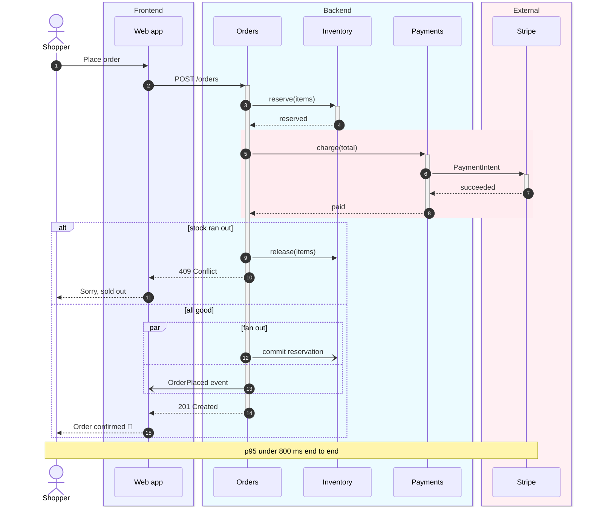

# Shop platform

## Platform overview

```mermaid
flowchart LR
  subgraph clients[Clients]
    web([Web app]):::client
    ios([iOS app]):::client
    partner([Partner API]):::client
  end
  subgraph edge[Edge]
    cdn{{CDN}}:::edge
    waf{{WAF}}:::edge
    gw{{API gateway}}:::edge
  end
  subgraph services[Services]
    catalog[Catalog]:::svc
    cart[Cart]:::svc
    orders[Orders]:::svc
    pay[Payments]:::pay
    stock[Inventory]:::svc
    notify[Notifications]:::svc
  end
  subgraph data[Data]
    pg[(Postgres)]:::db
    redis[(Redis)]:::db
    bus>Kafka]:::bus
  end
  stripe[/Stripe/]:::ext
  mail[/SendGrid/]:::ext

  web & ios --> cdn --> waf --> gw
  partner --> gw
  gw --> catalog & cart & orders
  cart --> redis
  orders --> pg
  orders ==> pay ==> stripe
  orders -. OrderPlaced .-> bus
  bus -.-> stock & notify
  notify --> mail
  catalog --> pg

  classDef client fill:#7aa2f7,stroke:#3d59a1,color:#fff
  classDef edge fill:#bb9af7,stroke:#6d4aa8,color:#fff
  classDef svc fill:#2ac3de,stroke:#1f7a8c,color:#fff
  classDef pay fill:#f7768e,stroke:#a63d52,color:#fff
  classDef db fill:#9ece6a,stroke:#4f7a2f,color:#1a1b26
  classDef bus fill:#ff9e64,stroke:#b45f2a,color:#1a1b26
  classDef ext fill:#e0af68,stroke:#8c6a2f,color:#1a1b26
  style clients fill:#eef2ff,stroke:#7aa2f7
  style edge fill:#f5f0ff,stroke:#bb9af7
  style services fill:#ecfbff,stroke:#2ac3de
  style data fill:#f2fbe9,stroke:#9ece6a
  linkStyle 10,11 stroke:#f7768e,stroke-width:3px
  linkStyle 12,13,14 stroke:#ff9e64,stroke-width:2px
```

## Checkout

```mermaid
sequenceDiagram
  autonumber
  actor S as Shopper
  box rgb(238,242,255) Frontend
    participant W as Web app
  end
  box rgb(236,251,255) Backend
    participant O as Orders
    participant I as Inventory
    participant P as Payments
  end
  box rgb(255,240,243) External
    participant X as Stripe
  end

  S->>W: Place order
  W->>+O: POST /orders
  O->>+I: reserve(items)
  I-->>-O: reserved
  rect rgb(255,236,240)
    O->>+P: charge(total)
    P->>+X: PaymentIntent
    X-->>-P: succeeded
    P-->>-O: paid
  end
  alt stock ran out
    O->>I: release(items)
    O-->>W: 409 Conflict
    W-->>S: Sorry, sold out
  else all good
    par fan out
      O-)I: commit reservation
    and
      O-)W: OrderPlaced event
    end
    O-->>-W: 201 Created
    W-->>S: Order confirmed 🎉
  end
  Note over S,X: p95 under 800 ms end to end
```
