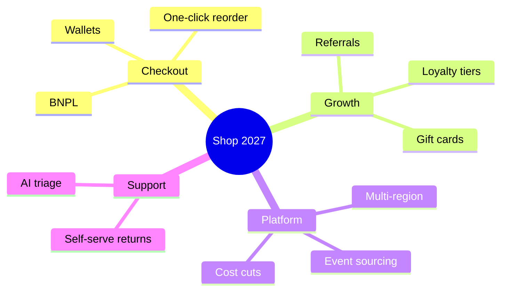
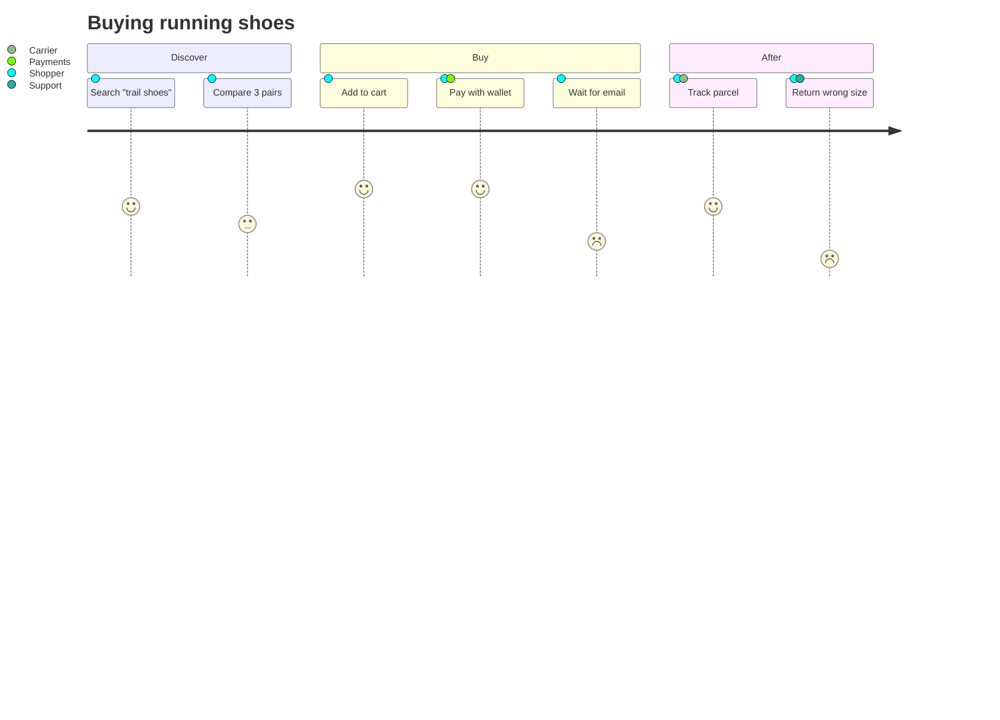
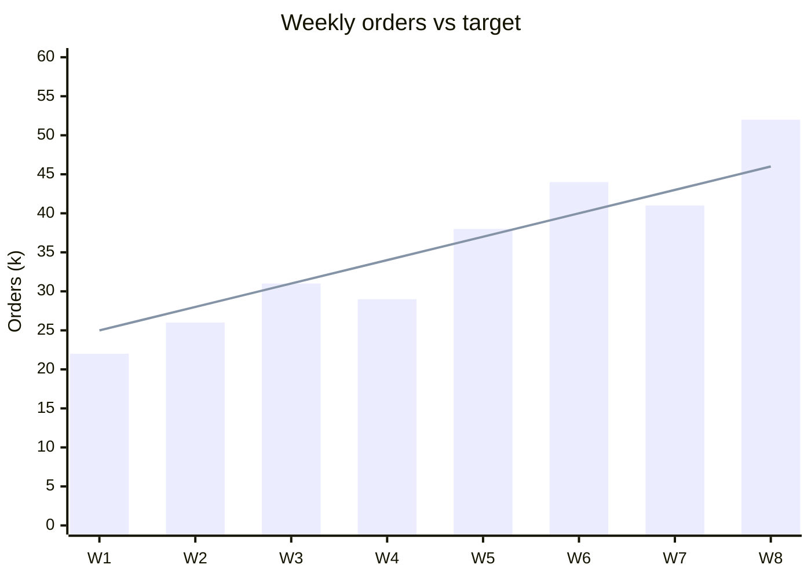
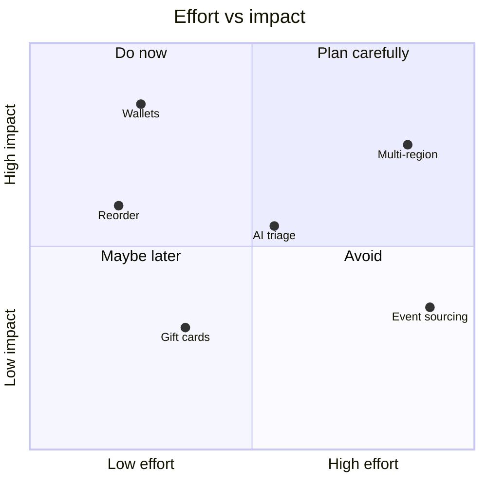

# Research notes

## Ideas

```mermaid
mindmap
  root((Shop 2027))
    Checkout
      Wallets
      One-click reorder
      BNPL
    Growth
      Referrals
      Loyalty tiers
      Gift cards
    Platform
      Multi-region
      Event sourcing
      Cost cuts
    Support
      Self-serve returns
      AI triage
```

## Customer journey

```mermaid
journey
  title Buying running shoes
  section Discover
    Search "trail shoes": 4: Shopper
    Compare 3 pairs: 3: Shopper
  section Buy
    Add to cart: 5: Shopper
    Pay with wallet: 5: Shopper, Payments
    Wait for email: 2: Shopper
  section After
    Track parcel: 4: Shopper, Carrier
    Return wrong size: 1: Shopper, Support
```

## Weekly sales

```mermaid
xychart-beta
  title "Weekly orders vs target"
  x-axis [W1, W2, W3, W4, W5, W6, W7, W8]
  y-axis "Orders (k)" 0 --> 60
  bar [22, 26, 31, 29, 38, 44, 41, 52]
  line [25, 28, 31, 34, 37, 40, 43, 46]
```

## Priorities

```mermaid
quadrantChart
  title Effort vs impact
  x-axis Low effort --> High effort
  y-axis Low impact --> High impact
  quadrant-1 Plan carefully
  quadrant-2 Do now
  quadrant-3 Maybe later
  quadrant-4 Avoid
  Wallets: [0.25, 0.85]
  Reorder: [0.2, 0.6]
  Multi-region: [0.85, 0.75]
  Gift cards: [0.35, 0.3]
  Event sourcing: [0.9, 0.35]
  AI triage: [0.55, 0.55]
```
