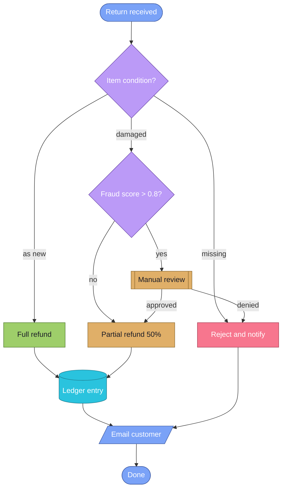
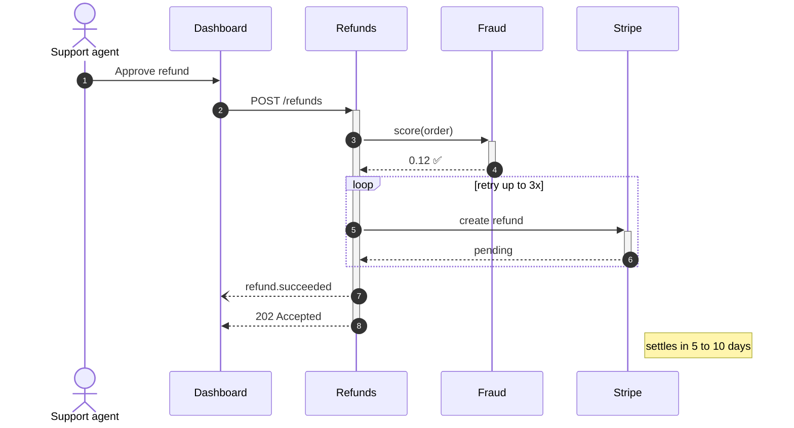

# Refunds

## Refund decision

```mermaid
flowchart TD
  start([Return received]):::io --> inspect{Item condition?}:::decide
  inspect -->|as new| full[Full refund]:::good
  inspect -->|damaged| fraud{Fraud score > 0.8?}:::decide
  inspect -->|missing| reject[Reject and notify]:::bad
  fraud -->|yes| review[[Manual review]]:::warn
  fraud -->|no| partial[Partial refund 50%]:::warn
  review -->|approved| partial
  review -->|denied| reject
  full & partial --> ledger[(Ledger entry)]:::data
  ledger --> email[/Email customer/]:::io
  reject --> email
  email --> done([Done]):::io

  classDef io fill:#7aa2f7,stroke:#3d59a1,color:#fff
  classDef decide fill:#bb9af7,stroke:#6d4aa8,color:#fff
  classDef good fill:#9ece6a,stroke:#4f7a2f,color:#1a1b26
  classDef warn fill:#e0af68,stroke:#8c6a2f,color:#1a1b26
  classDef bad fill:#f7768e,stroke:#a63d52,color:#fff
  classDef data fill:#2ac3de,stroke:#1f7a8c,color:#fff
```

## Refund call

```mermaid
sequenceDiagram
  autonumber
  actor A as Support agent
  participant D as Dashboard
  participant R as Refunds
  participant F as Fraud
  participant X as Stripe
  A->>D: Approve refund
  D->>+R: POST /refunds
  R->>+F: score(order)
  F-->>-R: 0.12 ✅
  loop retry up to 3x
    R->>+X: create refund
    X-->>-R: pending
  end
  R--)D: refund.succeeded
  R-->>-D: 202 Accepted
  Note right of X: settles in 5 to 10 days
```
