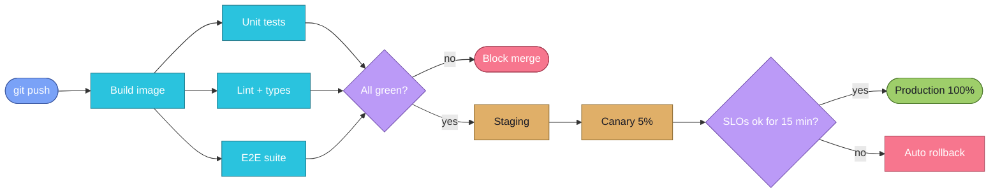
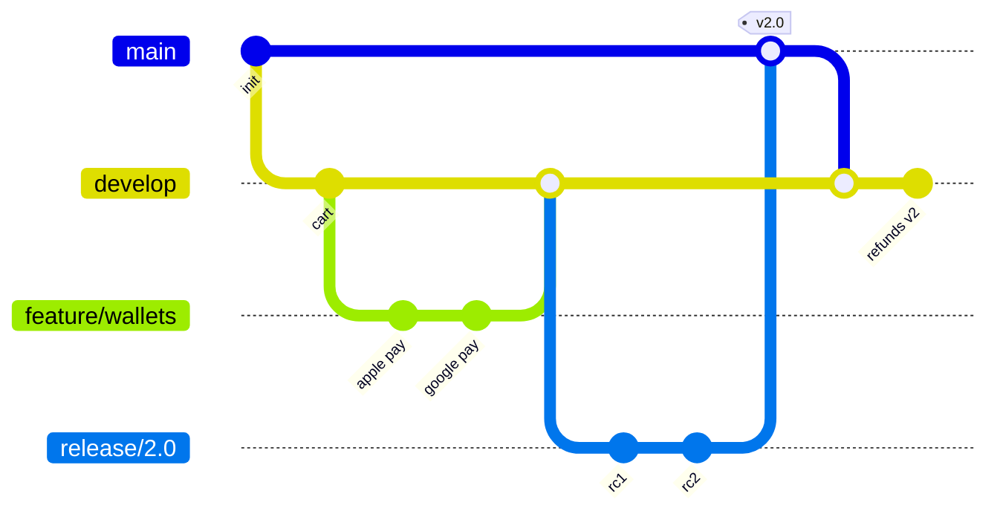
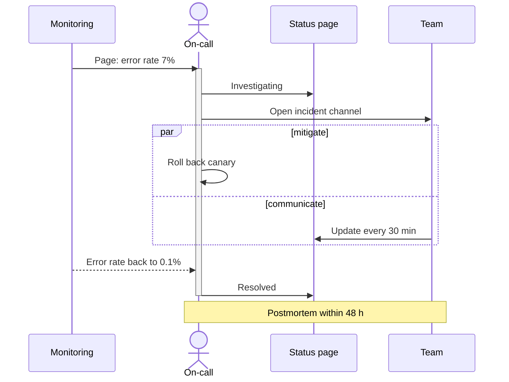

# Shipping code

## Pipeline

```mermaid
flowchart LR
  push([git push]):::io --> build[Build image]:::step
  build --> unit[Unit tests]:::step & lint[Lint + types]:::step & e2e[E2E suite]:::step
  unit & lint & e2e --> gate{All green?}:::decide
  gate -->|no| fail([Block merge]):::bad
  gate -->|yes| stg[Staging]:::env
  stg --> canary[Canary 5%]:::env
  canary --> watch{SLOs ok for 15 min?}:::decide
  watch -->|yes| prod([Production 100%]):::good
  watch -->|no| rollback[Auto rollback]:::bad

  classDef io fill:#7aa2f7,stroke:#3d59a1,color:#fff
  classDef step fill:#2ac3de,stroke:#1f7a8c,color:#fff
  classDef decide fill:#bb9af7,stroke:#6d4aa8,color:#fff
  classDef env fill:#e0af68,stroke:#8c6a2f,color:#1a1b26
  classDef good fill:#9ece6a,stroke:#4f7a2f,color:#1a1b26
  classDef bad fill:#f7768e,stroke:#a63d52,color:#fff
```

## Branching

```mermaid
gitGraph
  commit id: "init"
  branch develop
  checkout develop
  commit id: "cart"
  branch feature/wallets
  checkout feature/wallets
  commit id: "apple pay"
  commit id: "google pay"
  checkout develop
  merge feature/wallets
  branch release/2.0
  checkout release/2.0
  commit id: "rc1"
  commit id: "rc2"
  checkout main
  merge release/2.0 tag: "v2.0"
  checkout develop
  merge main
  commit id: "refunds v2"
```

## Incident response

```mermaid
sequenceDiagram
  participant M as Monitoring
  actor O as On-call
  participant S as Status page
  participant T as Team
  M->>O: Page: error rate 7%
  activate O
  O->>S: Investigating
  O->>T: Open incident channel
  par mitigate
    O->>O: Roll back canary
  and communicate
    T->>S: Update every 30 min
  end
  M-->>O: Error rate back to 0.1%
  O->>S: Resolved
  deactivate O
  Note over O,T: Postmortem within 48 h
```
