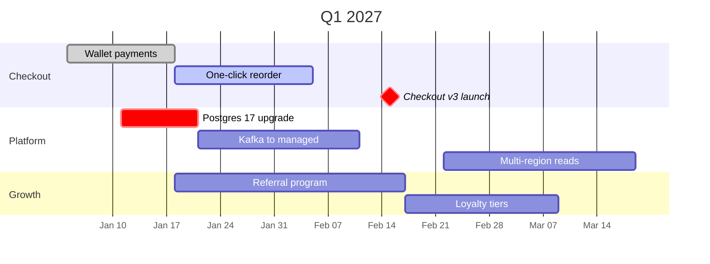
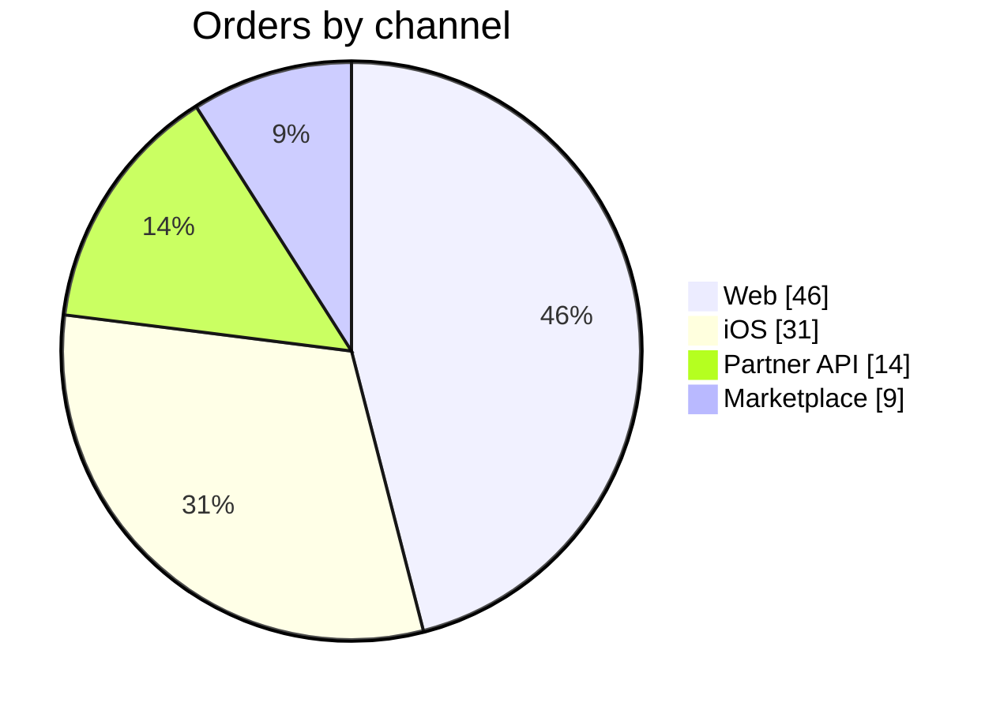
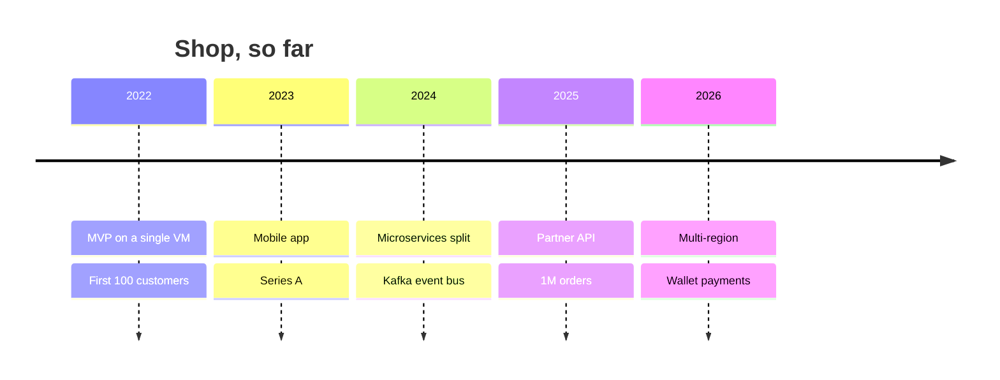

# 2027 roadmap

## Q1 plan

```mermaid
gantt
  title Q1 2027
  dateFormat YYYY-MM-DD
  axisFormat %b %d
  section Checkout
    Wallet payments      :done,   w1, 2027-01-04, 14d
    One-click reorder    :active, w2, after w1, 18d
    Checkout v3 launch   :milestone, crit, m1, 2027-02-15, 0d
  section Platform
    Postgres 17 upgrade  :crit,   p1, 2027-01-11, 10d
    Kafka to managed     :        p2, after p1, 21d
    Multi-region reads   :        p3, 2027-02-22, 25d
  section Growth
    Referral program     :        g1, 2027-01-18, 30d
    Loyalty tiers        :        g2, after g1, 20d
```

## Where orders come from

```mermaid
pie showData
  title Orders by channel
  "Web" : 46
  "iOS" : 31
  "Partner API" : 14
  "Marketplace" : 9
```

## History

```mermaid
timeline
  title Shop, so far
  2022 : MVP on a single VM : First 100 customers
  2023 : Mobile app : Series A
  2024 : Microservices split : Kafka event bus
  2025 : Partner API : 1M orders
  2026 : Multi-region : Wallet payments
```
