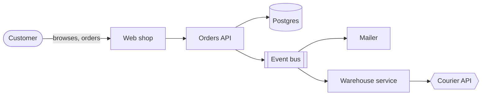
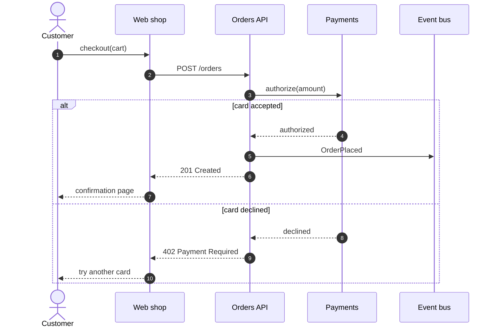

# Bookshop system

Mock architecture notes for trying out trawl.

## Context

```mermaid
flowchart LR
  customer([Customer]) -->|browses, orders| web[Web shop]
  web --> api[Orders API]
  api --> db[(Postgres)]
  api --> queue[[Event bus]]
  queue --> mailer[Mailer]
  queue --> warehouse[Warehouse service]
  warehouse --> courier{{Courier API}}
```

## Placing an order

```mermaid
sequenceDiagram
  autonumber
  actor C as Customer
  participant W as Web shop
  participant A as Orders API
  participant P as Payments
  participant B as Event bus

  C->>W: checkout(cart)
  W->>A: POST /orders
  A->>P: authorize(amount)
  alt card accepted
    P-->>A: authorized
    A->>B: OrderPlaced
    A-->>W: 201 Created
    W-->>C: confirmation page
  else card declined
    P-->>A: declined
    A-->>W: 402 Payment Required
    W-->>C: try another card
  end
```
