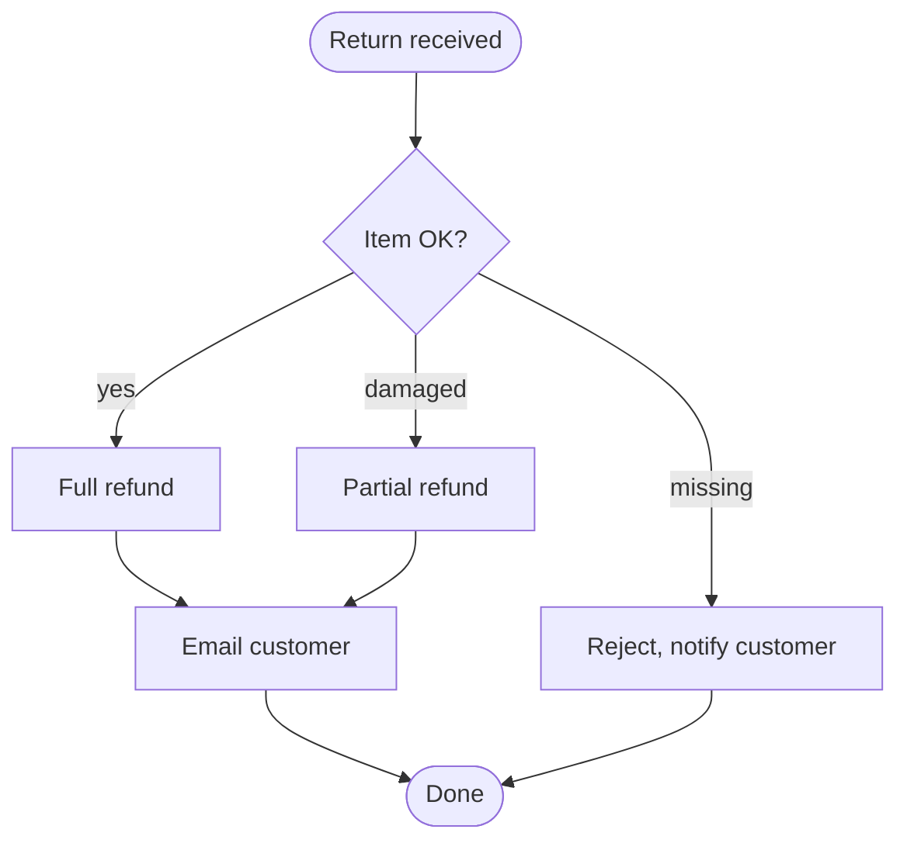
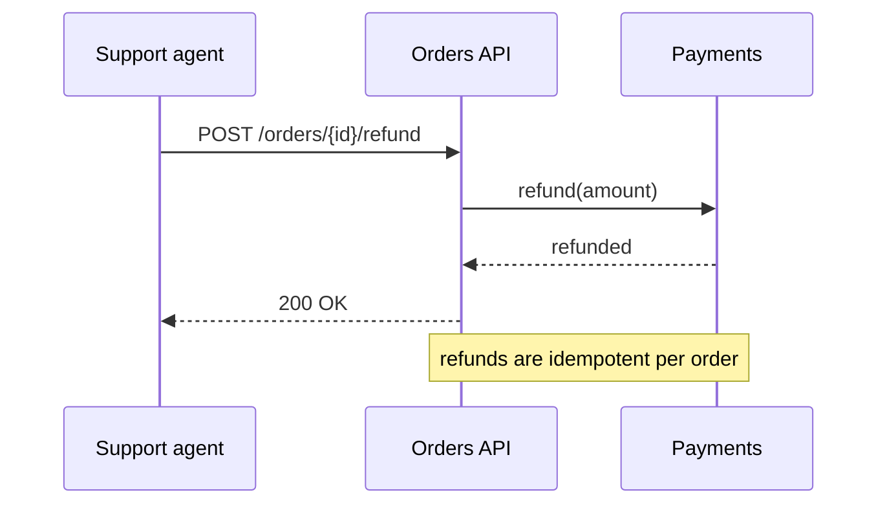

# Refunds

```mermaid
flowchart TD
  start([Return received]) --> inspect{Item OK?}
  inspect -->|yes| full[Full refund]
  inspect -->|damaged| partial[Partial refund]
  inspect -->|missing| reject[Reject, notify customer]
  full --> notify[Email customer]
  partial --> notify
  notify --> done([Done])
  reject --> done
```

## Refund call

```mermaid
sequenceDiagram
  participant S as Support agent
  participant A as Orders API
  participant P as Payments
  S->>A: POST /orders/{id}/refund
  A->>P: refund(amount)
  P-->>A: refunded
  A-->>S: 200 OK
  Note over A,P: refunds are idempotent per order
```
