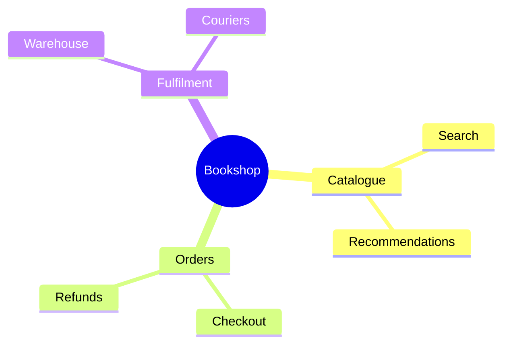
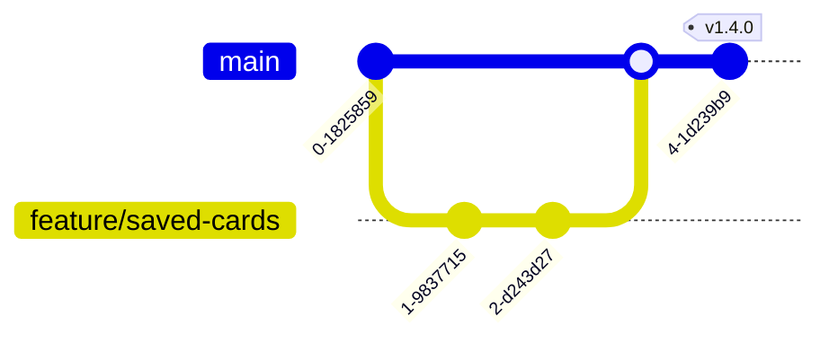
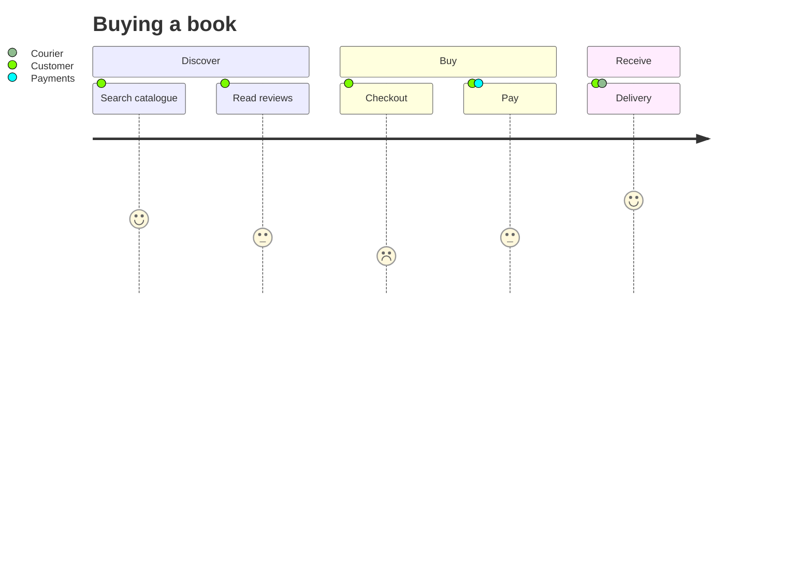
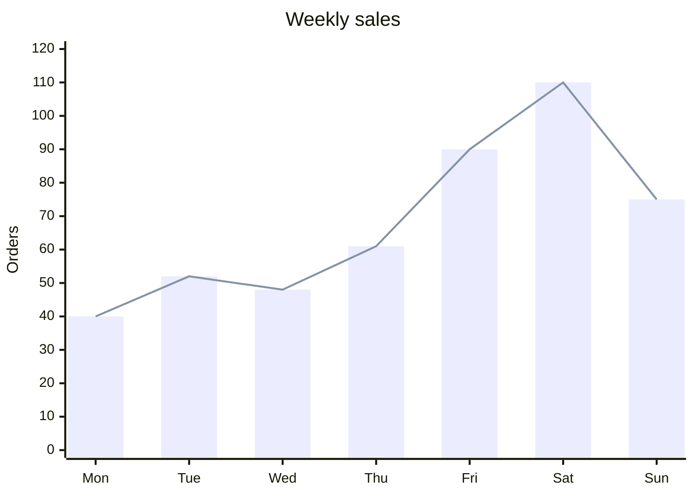
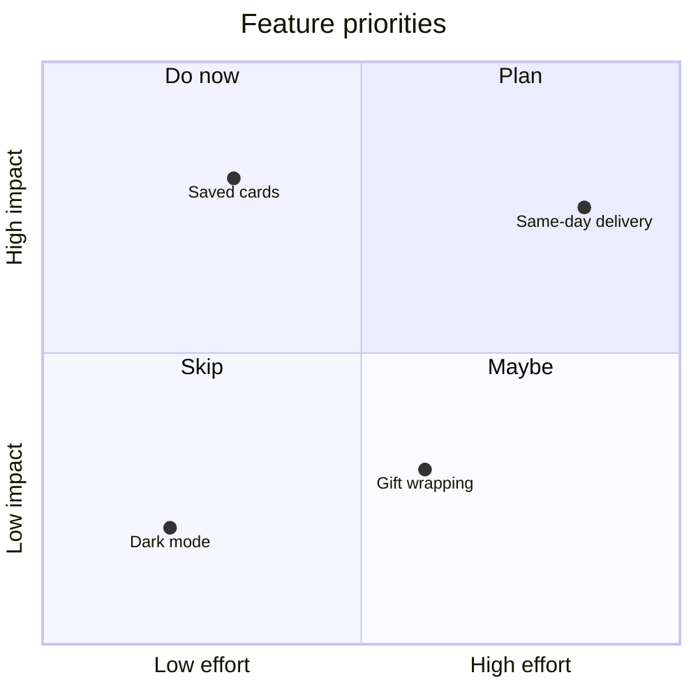

# More diagram types

## Mind map

```mermaid
mindmap
  root((Bookshop))
    Catalogue
      Search
      Recommendations
    Orders
      Checkout
      Refunds
    Fulfilment
      Warehouse
      Couriers
```

## Release branches

```mermaid
gitGraph
  commit
  branch feature/saved-cards
  checkout feature/saved-cards
  commit
  commit
  checkout main
  merge feature/saved-cards
  commit tag: "v1.4.0"
```

## Customer journey

```mermaid
journey
  title Buying a book
  section Discover
    Search catalogue: 4: Customer
    Read reviews: 3: Customer
  section Buy
    Checkout: 2: Customer
    Pay: 3: Customer, Payments
  section Receive
    Delivery: 5: Customer, Courier
```

## Weekly sales

```mermaid
xychart-beta
  title "Weekly sales"
  x-axis [Mon, Tue, Wed, Thu, Fri, Sat, Sun]
  y-axis "Orders" 0 --> 120
  bar [40, 52, 48, 61, 90, 110, 75]
  line [40, 52, 48, 61, 90, 110, 75]
```

## Priorities

```mermaid
quadrantChart
  title Feature priorities
  x-axis Low effort --> High effort
  y-axis Low impact --> High impact
  quadrant-1 Plan
  quadrant-2 Do now
  quadrant-3 Skip
  quadrant-4 Maybe
  Saved cards: [0.3, 0.8]
  Same-day delivery: [0.85, 0.75]
  Dark mode: [0.2, 0.2]
  Gift wrapping: [0.6, 0.3]
```
